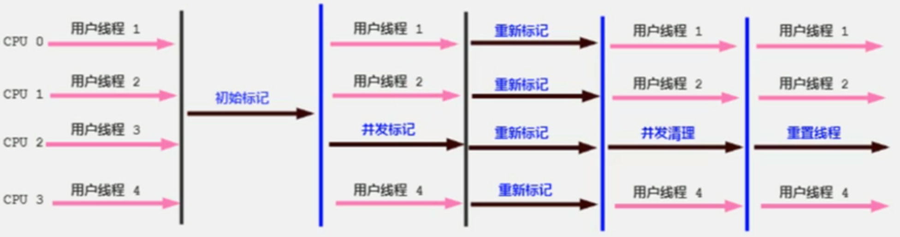
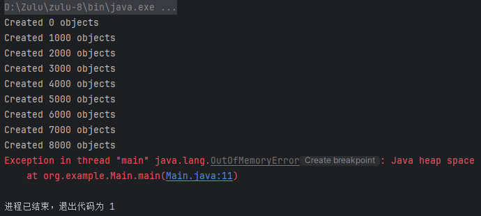
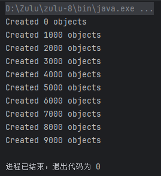

# CMS GC调研
## CMS收集器
在JDK1.5，HotSpot推出了一款在强交互应用中几乎可认为有划时代意义的垃圾收集器：CMS（Concurrent-Mark-Sweep）收集器，这款收集器是HotSpot虚拟机中第一款真正意义上的并发（注意这里的并发和之前的并行是有区别的，并发可以理解为同时运行用户线程和GC线程，而并行可以理解为多条GC线程同时工作）收集器，它第一次实现了让垃圾收集线程与用户线程同时工作。

它主要采用标记清除算法：



它的垃圾回收分为4个阶段：

* 初始标记（需要暂停用户线程）：这个阶段的主要任务仅仅只是标记出GC Roots能直接关联到的对象，速度比较快，不用担心会停顿太长时间。

* 并发标记：从GC Roots的直接关联对象开始遍历整个对象图的过程，这个过程耗时较长但是不需要停顿用户线程，可以与垃圾收集线程一起并发运行。
* 重新标记（需要暂停用户线程）：由于并发标记阶段可能某些用户线程会导致标记产生变得，因此这里需要再次暂停所有线程进行并行标记，这个时间会比初始标记时间长一丢丢。
* 并发清除：最后就可以直接将所有标记好的无用对象进行删除，因为这些对象程序中也用不到了，所以可以与用户线程并发运行。

## 场景一
该场景模拟通常程序运行时的状态，其中所有的对象都没有销毁，该场景目的是探究CMS GC的工作流程以及与ParNewGC协同工作时的过程，同时方便对日志中基础部分进行解释。

### 程序设计
所设计java程序源代码如下：
``` java
public class Main {
    public static void main(String[] args) {
        List<Object> list = new ArrayList<>();
        for (int i = 0; i < 100000; i++) {
            list.add(new byte[1024 * 1024]); // Allocate 1MB objects
            if (i % 1000 == 0) {
                System.out.println("Created " + i + " objects");
            }
            try {
                Thread.sleep(10); // Slow down the allocation
            } catch (InterruptedException e) {
                e.printStackTrace();
            }
        }
    }
}
```
其中，jvm参数设置如下：
```
-XX:+UseConcMarkSweepGC
-Xloggc:gc.log
-XX:+PrintGCDetails
-XX:+PrintGCDateStamps
-XX:+PrintGCTimeStamps
-XX:+PrintHeapAtGC
```
这些JVM参数主要用于垃圾收集器的选择和垃圾收集的日志记录。下面是每个参数的详细解释：

* **-XX:+UseConcMarkSweepGC**：启用并发标记清除垃圾收集器（CMS）
* **-Xloggc:gc.log**：将垃圾收集的日志输出到指定的文件中。这些日志包含有关垃圾收集活动的信息，有助于调试和优化JVM性能。
* **-XX:+PrintGCDetails**：打印垃圾收集的详细信息。这包括每次垃圾收集的类型、时间、内存使用情况等详细数据。
* **-XX:+PrintGCDateStamps**：在垃圾收集日志中打印时间戳，显示垃圾收集发生的具体时间。
* **-XX:+PrintGCTimeStamps**：在垃圾收集日志中打印相对时间戳，即自JVM启动以来的时间。
* **-XX:+PrintHeapAtGC**：在每次垃圾收集前后打印堆内存的使用情况。这有助于了解垃圾收集前后的内存变化，便于分析内存使用情况和优化堆配置。

程序运行结果如下：


### 日志分析
该场景完整日志参阅[gc.log](./appendix/gc.log)。

#### 1. 系统环境信息
```log
Memory: 4k page, physical 33363216k(19571208k free), swap 35460368k(18942048k free)
```
表示系统的内存页面大小为4KB。物理内存总量为33363216KB（约32GB），其中19571208KB（约18.7GB）是空闲的。交换空间（虚拟内存）总量为35460368KB（约33.8GB），其中18942048KB（约18GB）是空闲的。

#### 2. JVM配置
```log
CommandLine flags: -XX:InitialHeapSize=533811456 -XX:MaxHeapSize=8540983296 -XX:MaxNewSize=872415232 -XX:MaxTenuringThreshold=6 -XX:OldPLABSize=16 -XX:+PrintGC -XX:+PrintGCDateStamps -XX:+PrintGCDetails -XX:+PrintGCTimeStamps -XX:+PrintHeapAtGC -XX:+UseCompressedClassPointers -XX:+UseCompressedOops -XX:+UseConcMarkSweepGC -XX:-UseLargePagesIndividualAllocation -XX:+UseParNewGC 
```
每个标志从前至后依次意味着：
* 设置JVM初始堆大小为533,811,456字节（约509MB）。
* 设置JVM最大堆大小为8,540,983,296字节（约7.95GB）。
* 设置新生代的最大大小为872,415,232字节（约832MB）。
* 设置对象从新生代晋升到老年代的最大年龄阈值为6（即对象在新生代中经历6次垃圾收集后才会被晋升到老年代）。
* 设置老年代的Promotion Local Allocation Buffers（PLAB）的大小为16KB。
* 启用垃圾收集的基本信息打印。
* 在垃圾收集日志中打印日期时间戳，显示垃圾收集发生的具体时间。
* 打印垃圾收集的详细信息，包括每次垃圾收集的类型、时间、内存使用情况等。
* 在垃圾收集日志中打印相对时间戳，即自JVM启动以来的时间。
* 在每次垃圾收集前后打印堆内存的使用情况。
* 启用压缩类指针，以减少堆内存占用。这对于64位JVM特别有用，因为可以减少指针的大小。
* 启用压缩普通对象指针（ordinary object pointers），以减少64位JVM中的指针大小，节省内存空间。
* 启用并发标记清除垃圾收集器（CMS）
* 禁用大页面的单独分配
* 启用ParNew垃圾收集器，这是一个新生代垃圾收集器，通常与CMS垃圾收集器一起使用。

#### 3. 垃圾回收过程
##### (1)第一次次要垃圾回收(Minor GC)
```log
{Heap before GC invocations=0 (full 0):
 par new generation   total 156672K, used 139143K [0x00000005c2e00000, 0x00000005cd800000, 0x00000005f6e00000)
  eden space 139264K,  99% used [0x00000005c2e00000, 0x00000005cb5e1c88, 0x00000005cb600000)
  from space 17408K,   0% used [0x00000005cb600000, 0x00000005cb600000, 0x00000005cc700000)
  to   space 17408K,   0% used [0x00000005cc700000, 0x00000005cc700000, 0x00000005cd800000)
 concurrent mark-sweep generation total 348160K, used 0K [0x00000005f6e00000, 0x000000060c200000, 0x00000007c0000000)
 Metaspace       used 3900K, capacity 4604K, committed 4864K, reserved 1056768K
  class space    used 420K, capacity 428K, committed 512K, reserved 1048576K
2024-07-15T10:56:53.580+0800: 1.424: [GC (Allocation Failure) 2024-07-15T10:56:53.581+0800: 1.425: [ParNew: 139143K->16473K(156672K), 0.0530981 secs] 139143K->130145K(504832K), 0.0542272 secs] [Times: user=0.38 sys=0.11, real=0.05 secs] 
Heap after GC invocations=1 (full 0):
 par new generation   total 156672K, used 16473K [0x00000005c2e00000, 0x00000005cd800000, 0x00000005f6e00000)
  eden space 139264K,   0% used [0x00000005c2e00000, 0x00000005c2e00000, 0x00000005cb600000)
  from space 17408K,  94% used [0x00000005cc700000, 0x00000005cd716480, 0x00000005cd800000)
  to   space 17408K,   0% used [0x00000005cb600000, 0x00000005cb600000, 0x00000005cc700000)
 concurrent mark-sweep generation total 348160K, used 113671K [0x00000005f6e00000, 0x000000060c200000, 0x00000007c0000000)
 Metaspace       used 3900K, capacity 4604K, committed 4864K, reserved 1056768K
  class space    used 420K, capacity 428K, committed 512K, reserved 1048576K
}
```
这是一次次要垃圾回收(Minor GC)，这是因为空间分配担保机制，老年代内存大于新生代所有对象总大小。
* **GC前的堆状态:** 这是JVM启动后的第一次GC调用，并且不是完全垃圾收集（full GC）。**年轻代**的总大小约**153MB**，已使用约**136MB**；其中Eden区总大小约136MB，已使用99%，from区总大小约17MB，未使用，to区总大小约17MB，未使用。**老年代**的总大小约**340MB**，**未使用**。元空间使用了3900KB，容量为4604KB，已提交4864KB，保留1056768KB。类空间使用了420KB，容量为428KB，已提交512KB，保留1048576KB。
* **GC事件:** 
   1. 时间戳: `2024-07-15T10:56:53.580+0800`指GC事件的日期和时间。`1.424`指自JVM启动以来的相对时间（秒）。
   2. GC类型和原因: `GC (Allocation Failure)`指这是一次GC事件，原因是内存分配失败。
   3. 年轻代GC: 年轻代从139143KB减少到16473KB，总大小为156672KB，耗时0.0530981秒。
   4. 堆总变化: 堆总大小从139143KB减少到130145KB，总容量为504832KB（约493MB），耗时0.0542272秒。
   5. 时间消耗: 用户态CPU时间为0.38秒，内核态CPU时间为0.11秒，实际时间为0.05秒。
* **GC后的堆状态:** 这是JVM启动后的第一次GC调用，并且不是full GC。**年轻代**的总大小为**153MB**，已使用**16MB**。其中，Eden区总大小为136MB，未使用；from总大小为17MB，已使用94%；to区总大小为17MB，未使用。**老年代**的总大小为**340MB**，已使用**111MB**。元空间使用了3900KB，容量为4604KB，已提交4864KB，保留1056768KB。类空间使用了420KB，容量为428KB，已提交512KB，保留1048576KB。
##### (2)第二次GC
```log
{Heap before GC invocations=1 (full 0):
 par new generation   total 156672K, used 155340K [0x00000005c2e00000, 0x00000005cd800000, 0x00000005f6e00000)
  eden space 139264K,  99% used [0x00000005c2e00000, 0x00000005cb59cf60, 0x00000005cb600000)
  from space 17408K,  94% used [0x00000005cc700000, 0x00000005cd716480, 0x00000005cd800000)
  to   space 17408K,   0% used [0x00000005cb600000, 0x00000005cb600000, 0x00000005cc700000)
 concurrent mark-sweep generation total 348160K, used 113671K [0x00000005f6e00000, 0x000000060c200000, 0x00000007c0000000)
 Metaspace       used 3900K, capacity 4604K, committed 4864K, reserved 1056768K
  class space    used 420K, capacity 428K, committed 512K, reserved 1048576K
2024-07-15T10:56:55.056+0800: 2.900: [GC (Allocation Failure) 2024-07-15T10:56:55.056+0800: 2.900: [ParNew: 155340K->16463K(156672K), 0.0360680 secs] 269012K->268317K(504832K), 0.0361894 secs] [Times: user=0.17 sys=0.11, real=0.04 secs] 
Heap after GC invocations=2 (full 0):
 par new generation   total 156672K, used 16463K [0x00000005c2e00000, 0x00000005cd800000, 0x00000005f6e00000)
  eden space 139264K,   0% used [0x00000005c2e00000, 0x00000005c2e00000, 0x00000005cb600000)
  from space 17408K,  94% used [0x00000005cb600000, 0x00000005cc613f88, 0x00000005cc700000)
  to   space 17408K,   0% used [0x00000005cc700000, 0x00000005cc700000, 0x00000005cd800000)
 concurrent mark-sweep generation total 348160K, used 251853K [0x00000005f6e00000, 0x000000060c200000, 0x00000007c0000000)
 Metaspace       used 3900K, capacity 4604K, committed 4864K, reserved 1056768K
  class space    used 420K, capacity 428K, committed 512K, reserved 1048576K
}
```
同样，这也是一次Minor GC。这是JVM启动后的第二次GC。
* 年轻代：GC前年轻代的总大小153MB，已使用151.6MB。其中，Eden区总大小为136MB，已使用99%。from区总大小17MB，已使用94%。to区总大小17MB，未使用。GC后年轻代已使用16MB。其中，Eden区未使用，from区已使用94%，to区未使用。
* 老年代：GC前老年代的总大小为340MB，已使用111MB。GC后老年代已使用246MB。
* 元空间无变化。
* 堆总变化：堆总大小从262.7MB减少到262MB，总容量为493MB，耗时0.0361894秒。
##### (3)CMS GC完整阶段
###### 初始标记阶段
```log
2024-07-15T10:56:55.097+0800: 2.940: [GC (CMS Initial Mark) [1 CMS-initial-mark: 251853K(348160K)] 269341K(504832K), 0.0004506 secs] [Times: user=0.00 sys=0.00, real=0.00 secs] 
```
`2024-07-15T10:56:55.097+0800`表示GC事件发生的日期和时间。`2.940`表示自JVM启动以来经过的相对时间（秒）。`GC (CMS Initial Mark)`表示这是一次CMS垃圾收集的初始标记阶段。`1 CMS-initial-mark: 251853K(348160K)`表示在初始标记阶段，CMS标记了老年代中246MB的内存（总容量340MB）。`269341K(504832K)`表示整个堆的总内存为493MB，其中使用了263MB。`[Times: user=0.00 sys=0.00, real=0.00 secs]`表示了标记花费的时间。

CMS的初始标记阶段是一次快速的标记阶段，它标记出所有直接可达的对象。这个阶段会引发一个短暂的STW（Stop-The-World）暂停。
###### 并发标记阶段
```log
2024-07-15T10:56:55.097+0800: 2.941: [CMS-concurrent-mark-start]
2024-07-15T10:56:55.099+0800: 2.942: [CMS-concurrent-mark: 0.001/0.001 secs] [Times: user=0.00 sys=0.00, real=0.00 secs] 
```
`[CMS-concurrent-mark-start]`表示CMS垃圾收集的并发标记阶段开始；`[CMS-concurrent-mark: 0.001/0.001 secs]`表示CMS垃圾收集的并发标记阶段完成，耗时0.001秒。

CMS并发标记阶段在应用程序线程运行时进行，标记对象图中所有存活的对象。这个阶段不需要STW（Stop-The-World）暂停。

###### 并发预清理阶段
```log
2024-07-15T10:56:55.099+0800: 2.942: [CMS-concurrent-preclean-start]
2024-07-15T10:56:55.100+0800: 2.943: [CMS-concurrent-preclean: 0.001/0.001 secs] [Times: user=0.00 sys=0.00, real=0.00 secs] 
```
`[CMS-concurrent-preclean-start]`表示CMS垃圾收集的并发预清理阶段开始。`[CMS-concurrent-preclean: 0.001/0.001 secs]`表示CMS垃圾收集的并发预清理阶段完成，耗时0.001秒。

CMS并发预清理阶段的主要目的是在应用程序线程运行时进行一些额外的清理工作，以减少在最终标记阶段需要处理的对象数量。这个阶段也不需要STW（Stop-The-World）暂停。
###### 最终标记阶段
```log
2024-07-15T10:56:55.100+0800: 2.943: [GC (CMS Final Remark) [YG occupancy: 17487 K (156672 K)]2024-07-15T10:56:55.100+0800: 2.943: [Rescan (parallel) , 0.0001225 secs]2024-07-15T10:56:55.100+0800: 2.943: [weak refs processing, 0.0000084 secs]2024-07-15T10:56:55.100+0800: 2.943: [class unloading, 0.0001804 secs]2024-07-15T10:56:55.100+0800: 2.943: [scrub symbol table, 0.0002839 secs]2024-07-15T10:56:55.100+0800: 2.944: [scrub string table, 0.0000887 secs][1 CMS-remark: 251853K(348160K)] 269341K(504832K), 0.0007291 secs] [Times: user=0.00 sys=0.00, real=0.00 secs] 
```
* `GC (CMS Final Remark)`：表示这是一次CMS垃圾收集的最终标记阶段。
* 年轻代的占用情况：当前占用17MB，总容量为153MB。
* `[Rescan (parallel), 0.0001225 secs]`：并行重新扫描阶段，耗时0.0001225秒。
* `[weak refs processing, 0.0000084 secs]`：处理弱引用，耗时0.0000084秒。
* `[class unloading, 0.0001804 secs]`：卸载类，耗时0.0001804秒。
* `[scrub symbol table, 0.0002839 secs]`：清理符号表，耗时0.0002839秒。
* `[scrub string table, 0.0000887 secs]`：清理字符串表，耗时0.0000887秒。
* `1 CMS-remark: 251853K(348160K)`：在最终标记阶段，CMS标记了老年代中246MB的内存（总容量340MB）。
* `269341K(504832K)`：整个堆的总内存为493MB，其中使用了263MB。
* `0.0007291 secs`：最终标记阶段总耗时0.0007291秒。

CMS最终标记阶段是一个短暂的STW（Stop-The-World）暂停阶段，主要用于标记所有存活对象。这一阶段对应用的影响较小。
###### 并发清除阶段
```log
2024-07-15T10:56:55.100+0800: 2.944: [CMS-concurrent-sweep-start]
2024-07-15T10:56:55.101+0800: 2.944: [CMS-concurrent-sweep: 0.000/0.000 secs] [Times: user=0.00 sys=0.00, real=0.00 secs] 
```
`[CMS-concurrent-sweep-start]`：表示CMS垃圾收集的并发清除阶段开始。`[CMS-concurrent-sweep: 0.000/0.000 secs]`：表示CMS垃圾收集的并发清除阶段完成，耗时0.000秒。

CMS并发清除阶段在应用程序线程运行时进行，它的主要任务是清除那些被标记为无用的对象。这个阶段不会引发STW（Stop-The-World）暂停，因此对应用的影响最小。

###### 并发重置阶段
```log
2024-07-15T10:56:55.101+0800: 2.944: [CMS-concurrent-reset-start]
2024-07-15T10:56:55.136+0800: 2.979: [CMS-concurrent-reset: 0.035/0.035 secs] [Times: user=0.00 sys=0.03, real=0.03 secs] 
```
`[CMS-concurrent-reset-start]`：表示CMS垃圾收集的并发重置阶段开始。`[CMS-concurrent-reset: 0.035/0.035 secs]`：表示CMS垃圾收集的并发重置阶段完成，耗时0.035秒。

CMS并发重置阶段是垃圾收集周期的最后一个阶段，负责重置CMS垃圾收集器的数据结构，以便为下一个垃圾收集周期做好准备。这个阶段也在应用程序线程运行时进行，不会引发STW（Stop-The-World）暂停。
##### (4)第三次GC
```log
{Heap before GC invocations=2 (full 1):
 par new generation   total 156672K, used 155361K [0x00000005c2e00000, 0x00000005cd800000, 0x00000005f6e00000)
  eden space 139264K,  99% used [0x00000005c2e00000, 0x00000005cb5a4768, 0x00000005cb600000)
  from space 17408K,  94% used [0x00000005cb600000, 0x00000005cc613f88, 0x00000005cc700000)
  to   space 17408K,   0% used [0x00000005cc700000, 0x00000005cc700000, 0x00000005cd800000)
 concurrent mark-sweep generation total 419756K, used 251852K [0x00000005f6e00000, 0x00000006107eb000, 0x00000007c0000000)
 Metaspace       used 3900K, capacity 4604K, committed 4864K, reserved 1056768K
  class space    used 420K, capacity 428K, committed 512K, reserved 1048576K
2024-07-15T10:56:56.500+0800: 4.343: [GC (Allocation Failure) 2024-07-15T10:56:56.500+0800: 4.344: [ParNew: 155361K->16386K(156672K), 0.0261958 secs] 407214K->406481K(576428K), 0.0262454 secs] [Times: user=0.19 sys=0.13, real=0.03 secs] 
Heap after GC invocations=3 (full 1):
 par new generation   total 156672K, used 16386K [0x00000005c2e00000, 0x00000005cd800000, 0x00000005f6e00000)
  eden space 139264K,   0% used [0x00000005c2e00000, 0x00000005c2e00000, 0x00000005cb600000)
  from space 17408K,  94% used [0x00000005cc700000, 0x00000005cd7009a8, 0x00000005cd800000)
  to   space 17408K,   0% used [0x00000005cb600000, 0x00000005cb600000, 0x00000005cc700000)
 concurrent mark-sweep generation total 419756K, used 390094K [0x00000005f6e00000, 0x00000006107eb000, 0x00000007c0000000)
 Metaspace       used 3900K, capacity 4604K, committed 4864K, reserved 1056768K
  class space    used 420K, capacity 428K, committed 512K, reserved 1048576K
}
```
这是JVM启动后的第三次GC，是一次Full GC。
* **年轻代**：**GC前**年轻代的总大小**153MB**，已使用**151.7MB**。其中，Eden区总大小为136MB，已使用99%。from区总大小17MB，已使用94%。to区总大小17MB，未使用。**GC后**年轻代已使用**16MB**。其中，Eden区未使用，from区已使用94%，to区未使用。
* **老年代**：**GC前**老年代的总大小为**409.9MB**，已使用**246MB**。GC后老年代已使用**380MB**。
* **元空间**无变化。
* **堆总变化**：堆总大小从397.6MB减少到397MB，总容量为563MB，耗时0.0261958秒。

这时，老年代空间大小增大，导致整个堆的空间增大。后续一直重复上述流程，由于**空间分配担保机制**，当Eden区满且老年代空间足够时，触发Minor GC；若老年代空间不够，则触发Full GC，增加老年代空间至能够放置新生代所有对象。如此循环直至堆到达最大容量。
##### (5)老年代空间到达上限时GC
```log
{Heap before GC invocations=54 (full 13):
 par new generation   total 156672K, used 155349K [0x00000005c2e00000, 0x00000005cd800000, 0x00000005f6e00000)
  eden space 139264K,  99% used [0x00000005c2e00000, 0x00000005cb5b5390, 0x00000005cb600000)
  from space 17408K,  94% used [0x00000005cb600000, 0x00000005cc600100, 0x00000005cc700000)
  to   space 17408K,   0% used [0x00000005cc700000, 0x00000005cc700000, 0x00000005cd800000)
 concurrent mark-sweep generation total 7489536K, used 7440479K [0x00000005f6e00000, 0x00000007c0000000, 0x00000007c0000000)
 Metaspace       used 3900K, capacity 4604K, committed 4864K, reserved 1056768K
  class space    used 420K, capacity 428K, committed 512K, reserved 1048576K
2024-07-15T10:58:12.655+0800: 80.499: [GC (Allocation Failure) 2024-07-15T10:58:12.655+0800: 80.499: [ParNew: 155349K->155349K(156672K), 0.0000483 secs]2024-07-15T10:58:12.655+0800: 80.499: [CMS: 7440479K->7488587K(7489536K), 0.7750014 secs] 7595828K->7595085K(7646208K), [Metaspace: 3900K->3900K(1056768K)], 0.7761433 secs] [Times: user=0.77 sys=0.01, real=0.78 secs] 
Heap after GC invocations=55 (full 14):
 par new generation   total 766784K, used 106497K [0x00000005c2e00000, 0x00000005f6e00000, 0x00000005f6e00000)
  eden space 681600K,  15% used [0x00000005c2e00000, 0x00000005c9600680, 0x00000005ec7a0000)
  from space 85184K,   0% used [0x00000005ec7a0000, 0x00000005ec7a0000, 0x00000005f1ad0000)
  to   space 85184K,   0% used [0x00000005f1ad0000, 0x00000005f1ad0000, 0x00000005f6e00000)
 concurrent mark-sweep generation total 7489536K, used 7488587K [0x00000005f6e00000, 0x00000007c0000000, 0x00000007c0000000)
 Metaspace       used 3900K, capacity 4604K, committed 4864K, reserved 1056768K
  class space    used 420K, capacity 428K, committed 512K, reserved 1048576K
}
```
这是JVM启动后的第55次GC，是第14次Full GC。
* **年轻代**：**GC前**年轻代的总大小**153MB**，已使用**151.7MB**。其中，Eden区总大小为136MB，已使用99%。from区总大小17MB，已使用94%。to区总大小17MB，未使用。**GC后**年轻代总大小**748.8MB**，已使用**104MB**。其中，Eden区总大小665.6MB，已使用15%，from区总大小83.2MB，未使用，to区总大小83.2MB，未使用。
* **老年代**：GC前老年代的总大小为**7314MB**，已使用**7266MB**。GC后老年代已使用**7313MB**。
* 元空间无变化。
* 堆总变化：堆总大小从397.6MB减少到397MB，总容量为563MB，耗时0.0261958秒。

这时，老年代空间已达上限，不再增加；开始增加年轻代空间。
##### (6)程序结束
```log
{Heap before GC invocations=56 (full 19):
 par new generation   total 766784K, used 765963K [0x00000005c2e00000, 0x00000005f6e00000, 0x00000005f6e00000)
  eden space 681600K,  99% used [0x00000005c2e00000, 0x00000005ec702990, 0x00000005ec7a0000)
  from space 85184K,  99% used [0x00000005ec7a0000, 0x00000005f1aa0530, 0x00000005f1ad0000)
  to   space 85184K,   0% used [0x00000005f1ad0000, 0x00000005f1ad0000, 0x00000005f6e00000)
 concurrent mark-sweep generation total 7489536K, used 7488587K [0x00000005f6e00000, 0x00000007c0000000, 0x00000007c0000000)
 Metaspace       used 3900K, capacity 4604K, committed 4864K, reserved 1056768K
  class space    used 420K, capacity 428K, committed 512K, reserved 1048576K
2024-07-15T10:58:20.781+0800: 88.625: [Full GC (Allocation Failure) 2024-07-15T10:58:20.781+0800: 88.625: [CMS: 7488587K->7488536K(7489536K), 0.5881454 secs] 8254551K->8254499K(8256320K), [Metaspace: 3900K->3900K(1056768K)], 0.5882016 secs] [Times: user=0.59 sys=0.00, real=0.59 secs] 
Heap after GC invocations=57 (full 20):
 par new generation   total 766784K, used 765963K [0x00000005c2e00000, 0x00000005f6e00000, 0x00000005f6e00000)
  eden space 681600K,  99% used [0x00000005c2e00000, 0x00000005ec702990, 0x00000005ec7a0000)
  from space 85184K,  99% used [0x00000005ec7a0000, 0x00000005f1aa0530, 0x00000005f1ad0000)
  to   space 85184K,   0% used [0x00000005f1ad0000, 0x00000005f1ad0000, 0x00000005f6e00000)
 concurrent mark-sweep generation total 7489536K, used 7488536K [0x00000005f6e00000, 0x00000007c0000000, 0x00000007c0000000)
 Metaspace       used 3900K, capacity 4604K, committed 4864K, reserved 1056768K
  class space    used 420K, capacity 428K, committed 512K, reserved 1048576K
}
2024-07-15T10:58:21.370+0800: 89.213: [GC (CMS Initial Mark) [1 CMS-initial-mark: 7488536K(7489536K)] 8255129K(8256320K), 0.0002674 secs] [Times: user=0.00 sys=0.00, real=0.00 secs] 
2024-07-15T10:58:21.370+0800: 89.213: [CMS-concurrent-mark-start]
Heap
 par new generation   total 766784K, used 766597K [0x00000005c2e00000, 0x00000005f6e00000, 0x00000005f6e00000)
  eden space 681600K, 100% used [0x00000005c2e00000, 0x00000005ec7a0000, 0x00000005ec7a0000)
  from space 85184K,  99% used [0x00000005ec7a0000, 0x00000005f1aa16b8, 0x00000005f1ad0000)
  to   space 85184K,   0% used [0x00000005f1ad0000, 0x00000005f1ad0000, 0x00000005f6e00000)
 concurrent mark-sweep generation total 7489536K, used 7488536K [0x00000005f6e00000, 0x00000007c0000000, 0x00000007c0000000)
 Metaspace       used 3931K, capacity 4604K, committed 4864K, reserved 1056768K
  class space    used 424K, capacity 428K, committed 512K, reserved 1048576K
2024-07-15T10:58:21.373+0800: 89.217: [CMS-concurrent-mark: 0.003/0.003 secs] [Times: user=0.00 sys=0.00, real=0.00 secs] 
```
这是`OutOfMemoryError`前最后的日志，此时堆已经占满，**年轻代**总大小：*8*，已使用：**748MB**，其中Eden空间：665.6MB，已使用99%，From空间：83.2MB，已使用99%；**老年代**总大小：**7314MB**，已使用：**7314MB**。

## 场景二
在场景一中，CMS GC确实处于工作中，但由于所有对象都处于被引用的状态，因此不会有对象被销毁；在场景二中模拟对象被创建后一段时间后销毁时垃圾回收的场景。

### 程序设计
所设计java程序源代码如下：
``` java
public class Main {
    public static void main(String[] args) {
        List<Object> list = new ArrayList<>();
        ScheduledExecutorService scheduler = Executors.newScheduledThreadPool(1);
        for (int i = 0; i < 10000; i++) {
            byte[] obj = new byte[1024 * 1024]; // Allocate 1MB objects
            list.add(obj);

            int finalI = i;
            scheduler.schedule(() -> {
                list.set(finalI, null);
            }, 1, TimeUnit.MILLISECONDS); // Schedule to set to null after 1ms

            if (i % 1000 == 0) {
                System.out.println("Created " + i + " objects");
            }
            try {
                Thread.sleep(1); // Slow down the allocation
            } catch (InterruptedException e) {
                e.printStackTrace();
            }
        }
        scheduler.shutdown();
    }
}
```
程序运行结果如下：

其中，jvm参数设置如下：
```
-XX:+UseConcMarkSweepGC
-Xloggc:gc1.log
-XX:+PrintGCDetails
-XX:+PrintGCDateStamps
-XX:+PrintGCTimeStamps
-XX:+PrintHeapAtGC
-Xms10M //设置堆初始大小10MB
-Xmx10M //设置堆最大大小10MB
```
### 日志分析

此时堆大小固定为10MB，且每个对象在创建1ms后销毁，因此本次分析将主要关注CMS GC部分。该场景完整日志参阅[gc1.log](./appendix/gc1.log)。

#### 垃圾回收过程
##### (1) 第一次CMS GC前后堆空间对比
```log
2024-07-15T20:51:19.457+0800: 0.114: [GC (CMS Initial Mark) [1 CMS-initial-mark: 3911K(6848K)] 5164K(9920K), 0.0001639 secs] [Times: user=0.00 sys=0.00, real=0.00 secs] 
2024-07-15T20:51:19.457+0800: 0.114: [CMS-concurrent-mark-start]
2024-07-15T20:51:19.458+0800: 0.115: [CMS-concurrent-mark: 0.001/0.001 secs] [Times: user=0.00 sys=0.00, real=0.00 secs] 
2024-07-15T20:51:19.458+0800: 0.115: [CMS-concurrent-preclean-start]
2024-07-15T20:51:19.458+0800: 0.115: [CMS-concurrent-preclean: 0.000/0.000 secs] [Times: user=0.00 sys=0.00, real=0.00 secs] 
2024-07-15T20:51:19.458+0800: 0.115: [GC (CMS Final Remark) [YG occupancy: 1252 K (3072 K)]2024-07-15T20:51:19.458+0800: 0.115: [Rescan (parallel) , 0.0001486 secs]2024-07-15T20:51:19.459+0800: 0.115: [weak refs processing, 0.0000168 secs]2024-07-15T20:51:19.459+0800: 0.115: [class unloading, 0.0002357 secs]2024-07-15T20:51:19.459+0800: 0.116: [scrub symbol table, 0.0002970 secs]2024-07-15T20:51:19.459+0800: 0.116: [scrub string table, 0.0000716 secs][1 CMS-remark: 3911K(6848K)] 5164K(9920K), 0.0008102 secs] [Times: user=0.00 sys=0.00, real=0.00 secs] 
2024-07-15T20:51:19.459+0800: 0.116: [CMS-concurrent-sweep-start]
2024-07-15T20:51:19.459+0800: 0.116: [CMS-concurrent-sweep: 0.000/0.000 secs] [Times: user=0.00 sys=0.00, real=0.00 secs] 
2024-07-15T20:51:19.459+0800: 0.116: [CMS-concurrent-reset-start]
2024-07-15T20:51:19.459+0800: 0.116: [CMS-concurrent-reset: 0.000/0.000 secs] [Times: user=0.00 sys=0.00, real=0.00 secs] 
{Heap before GC invocations=3 (full 1):
 par new generation   total 3072K, used 2328K [0x00000000ff600000, 0x00000000ff950000, 0x00000000ff950000)
  eden space 2752K,  76% used [0x00000000ff600000, 0x00000000ff80d148, 0x00000000ff8b0000)
  from space 320K,  71% used [0x00000000ff900000, 0x00000000ff9392b0, 0x00000000ff950000)
  to   space 320K,   0% used [0x00000000ff8b0000, 0x00000000ff8b0000, 0x00000000ff900000)
 concurrent mark-sweep generation total 6848K, used 834K [0x00000000ff950000, 0x0000000100000000, 0x0000000100000000)
 Metaspace       used 4474K, capacity 4786K, committed 4992K, reserved 1056768K
  class space    used 495K, capacity 533K, committed 640K, reserved 1048576K
2024-07-15T20:51:19.460+0800: 0.116: [GC (Allocation Failure) 2024-07-15T20:51:19.460+0800: 0.116: [ParNew: 2328K->75K(3072K), 0.0003078 secs] 3163K->1934K(9920K), 0.0003251 secs] [Times: user=0.00 sys=0.00, real=0.00 secs] 
Heap after GC invocations=4 (full 1):
 par new generation   total 3072K, used 75K [0x00000000ff600000, 0x00000000ff950000, 0x00000000ff950000)
  eden space 2752K,   0% used [0x00000000ff600000, 0x00000000ff600000, 0x00000000ff8b0000)
  from space 320K,  23% used [0x00000000ff8b0000, 0x00000000ff8c2d20, 0x00000000ff900000)
  to   space 320K,   0% used [0x00000000ff900000, 0x00000000ff900000, 0x00000000ff950000)
 concurrent mark-sweep generation total 6848K, used 1858K [0x00000000ff950000, 0x0000000100000000, 0x0000000100000000)
 Metaspace       used 4474K, capacity 4786K, committed 4992K, reserved 1056768K
  class space    used 495K, capacity 533K, committed 640K, reserved 1048576K
}
```
整个CMS GC时长为0.002s。
* **老年代**：CMS GC前老年代的总大小为6848KB，已使用**3911KB**，GC后老年代已使用**834KB**。表示CMS GC确实在工作中，回收了**3077KB**的空间。
##### (2)程序结束
```log
{Heap before GC invocations=5000 (full 1201):
 par new generation   total 3072K, used 2107K [0x00000000ff600000, 0x00000000ff950000, 0x00000000ff950000)
  eden space 2752K,  76% used [0x00000000ff600000, 0x00000000ff80dec0, 0x00000000ff8b0000)
  from space 320K,   1% used [0x00000000ff900000, 0x00000000ff901020, 0x00000000ff950000)
  to   space 320K,   0% used [0x00000000ff8b0000, 0x00000000ff8b0000, 0x00000000ff900000)
 concurrent mark-sweep generation total 6848K, used 3191K [0x00000000ff950000, 0x0000000100000000, 0x0000000100000000)
 Metaspace       used 5063K, capacity 5248K, committed 5504K, reserved 1056768K
  class space    used 554K, capacity 592K, committed 640K, reserved 1048576K
2024-07-15T20:51:38.064+0800: 18.721: [GC (Allocation Failure) 2024-07-15T20:51:38.064+0800: 18.721: [ParNew: 2107K->4K(3072K), 0.0006174 secs] 5299K->3195K(9920K), 0.0006677 secs] [Times: user=0.00 sys=0.00, real=0.00 secs] 
Heap after GC invocations=5001 (full 1201):
 par new generation   total 3072K, used 4K [0x00000000ff600000, 0x00000000ff950000, 0x00000000ff950000)
  eden space 2752K,   0% used [0x00000000ff600000, 0x00000000ff600000, 0x00000000ff8b0000)
  from space 320K,   1% used [0x00000000ff8b0000, 0x00000000ff8b1020, 0x00000000ff900000)
  to   space 320K,   0% used [0x00000000ff900000, 0x00000000ff900000, 0x00000000ff950000)
 concurrent mark-sweep generation total 6848K, used 3191K [0x00000000ff950000, 0x0000000100000000, 0x0000000100000000)
 Metaspace       used 5063K, capacity 5248K, committed 5504K, reserved 1056768K
  class space    used 554K, capacity 592K, committed 640K, reserved 1048576K
}
Heap
 par new generation   total 3072K, used 1111K [0x00000000ff600000, 0x00000000ff950000, 0x00000000ff950000)
  eden space 2752K,  40% used [0x00000000ff600000, 0x00000000ff714e38, 0x00000000ff8b0000)
  from space 320K,   1% used [0x00000000ff8b0000, 0x00000000ff8b1020, 0x00000000ff900000)
  to   space 320K,   0% used [0x00000000ff900000, 0x00000000ff900000, 0x00000000ff950000)
 concurrent mark-sweep generation total 6848K, used 3191K [0x00000000ff950000, 0x0000000100000000, 0x0000000100000000)
 Metaspace       used 5077K, capacity 5248K, committed 5504K, reserved 1056768K
  class space    used 557K, capacity 592K, committed 640K, reserved 1048576K
```
这是程序运行结束最后的日志，此时Full GC的次数为**1201**次。


## 场景三
在场景三中，将会修改JVM参数以在场景二的基础上减少Full GC的次数。场景三中的程序设计与场景二相同，仅对JVM参数进行更改。

### 增加堆的大小
#### JVM参数
```
-XX:+UseConcMarkSweepGC
-Xloggc:gc2.log
-XX:+PrintGCDetails
-XX:+PrintGCDateStamps
-XX:+PrintGCTimeStamps
-XX:+PrintHeapAtGC
-Xms20M //堆大小扩大一倍
-Xmx20M
```
#### 日志分析
该场景完整日志参阅[gc2.log](./appendix/gc2.log)。
```log
{Heap before GC invocations=1999 (full 256):
 par new generation   total 6144K, used 5233K [0x00000000fec00000, 0x00000000ff2a0000, 0x00000000ff2a0000)
  eden space 5504K,  95% used [0x00000000fec00000, 0x00000000ff11b7b0, 0x00000000ff160000)
  from space 640K,   0% used [0x00000000ff160000, 0x00000000ff161020, 0x00000000ff200000)
  to   space 640K,   0% used [0x00000000ff200000, 0x00000000ff200000, 0x00000000ff2a0000)
 concurrent mark-sweep generation total 13696K, used 7290K [0x00000000ff2a0000, 0x0000000100000000, 0x0000000100000000)
 Metaspace       used 5070K, capacity 5248K, committed 5504K, reserved 1056768K
  class space    used 554K, capacity 592K, committed 640K, reserved 1048576K
2024-07-16T11:01:51.672+0800: 16.552: [GC (Allocation Failure) 2024-07-16T11:01:51.672+0800: 16.552: [ParNew: 5233K->8K(6144K), 0.0014767 secs] 12524K->8324K(19840K), 0.0015746 secs] [Times: user=0.00 sys=0.00, real=0.00 secs] 
Heap after GC invocations=2000 (full 256):
 par new generation   total 6144K, used 8K [0x00000000fec00000, 0x00000000ff2a0000, 0x00000000ff2a0000)
  eden space 5504K,   0% used [0x00000000fec00000, 0x00000000fec00000, 0x00000000ff160000)
  from space 640K,   1% used [0x00000000ff200000, 0x00000000ff202040, 0x00000000ff2a0000)
  to   space 640K,   0% used [0x00000000ff160000, 0x00000000ff160000, 0x00000000ff200000)
 concurrent mark-sweep generation total 13696K, used 8316K [0x00000000ff2a0000, 0x0000000100000000, 0x0000000100000000)
 Metaspace       used 5070K, capacity 5248K, committed 5504K, reserved 1056768K
  class space    used 554K, capacity 592K, committed 640K, reserved 1048576K
}
Heap
 par new generation   total 6144K, used 5293K [0x00000000fec00000, 0x00000000ff2a0000, 0x00000000ff2a0000)
  eden space 5504K,  96% used [0x00000000fec00000, 0x00000000ff129550, 0x00000000ff160000)
  from space 640K,   1% used [0x00000000ff200000, 0x00000000ff202040, 0x00000000ff2a0000)
  to   space 640K,   0% used [0x00000000ff160000, 0x00000000ff160000, 0x00000000ff200000)
 concurrent mark-sweep generation total 13696K, used 8316K [0x00000000ff2a0000, 0x0000000100000000, 0x0000000100000000)
 Metaspace       used 5083K, capacity 5248K, committed 5504K, reserved 1056768K
  class space    used 557K, capacity 592K, committed 640K, reserved 1048576K
```
堆空间增大后，年轻代和老年代空间都相应增大。其中**年轻代6144KB**，之前为**3072K**；**老年代13696KB**，之前为**6848KB**。**Full GC**次数减少到**256**次，之前为**1201**次。

### 调整CMS触发阈值
#### JVM参数
```
-XX:+UseConcMarkSweepGC
-Xloggc:gc3.log
-XX:+PrintGCDetails
-XX:+PrintGCDateStamps
-XX:+PrintGCTimeStamps
-XX:+PrintHeapAtGC
-Xms10M 
-Xmx10M
-XX:CMSInitiatingOccupancyFraction=60 //当老年代堆内存达到60%时开始进行CMS GC
```
#### 日志分析
该场景完整日志参阅[gc3.log](./appendix/gc3.log)。
```log
{Heap before GC invocations=5000 (full 1081):
 par new generation   total 3072K, used 2107K [0x00000000ff600000, 0x00000000ff950000, 0x00000000ff950000)
  eden space 2752K,  76% used [0x00000000ff600000, 0x00000000ff80dec0, 0x00000000ff8b0000)
  from space 320K,   1% used [0x00000000ff900000, 0x00000000ff901020, 0x00000000ff950000)
  to   space 320K,   0% used [0x00000000ff8b0000, 0x00000000ff8b0000, 0x00000000ff900000)
 concurrent mark-sweep generation total 6848K, used 4213K [0x00000000ff950000, 0x0000000100000000, 0x0000000100000000)
 Metaspace       used 5063K, capacity 5248K, committed 5504K, reserved 1056768K
  class space    used 554K, capacity 592K, committed 640K, reserved 1048576K
2024-07-16T15:30:48.358+0800: 17.426: [GC (Allocation Failure) 2024-07-16T15:30:48.358+0800: 17.426: [ParNew: 2107K->2K(3072K), 0.0003145 secs] 6321K->4215K(9920K), 0.0003530 secs] [Times: user=0.00 sys=0.00, real=0.00 secs] 
Heap after GC invocations=5001 (full 1081):
 par new generation   total 3072K, used 2K [0x00000000ff600000, 0x00000000ff950000, 0x00000000ff950000)
  eden space 2752K,   0% used [0x00000000ff600000, 0x00000000ff600000, 0x00000000ff8b0000)
  from space 320K,   0% used [0x00000000ff8b0000, 0x00000000ff8b0810, 0x00000000ff900000)
  to   space 320K,   0% used [0x00000000ff900000, 0x00000000ff900000, 0x00000000ff950000)
 concurrent mark-sweep generation total 6848K, used 4213K [0x00000000ff950000, 0x0000000100000000, 0x0000000100000000)
 Metaspace       used 5063K, capacity 5248K, committed 5504K, reserved 1056768K
  class space    used 554K, capacity 592K, committed 640K, reserved 1048576K
}
Heap
 par new generation   total 3072K, used 1109K [0x00000000ff600000, 0x00000000ff950000, 0x00000000ff950000)
  eden space 2752K,  40% used [0x00000000ff600000, 0x00000000ff714e38, 0x00000000ff8b0000)
  from space 320K,   0% used [0x00000000ff8b0000, 0x00000000ff8b0810, 0x00000000ff900000)
  to   space 320K,   0% used [0x00000000ff900000, 0x00000000ff900000, 0x00000000ff950000)
 concurrent mark-sweep generation total 6848K, used 4213K [0x00000000ff950000, 0x0000000100000000, 0x0000000100000000)
 Metaspace       used 5077K, capacity 5248K, committed 5504K, reserved 1056768K
  class space    used 557K, capacity 592K, committed 640K, reserved 1048576K
```
阈值降低到60%（默认92%）后，**Full GC**次数减少到**1095**次，之前为**1201**次；CMS GC共触发了**717**次，之前为**782**次，这说明合理调节CMS触发阈值不但能减少Full GC的频率，还可以更有效地管理老年代的内存使用，减少CMS GC频率。

### 启用并发模式失败保护
#### JVM参数
```
-XX:+UseConcMarkSweepGC
-Xloggc:gc4.log
-XX:+PrintGCDetails
-XX:+PrintGCDateStamps
-XX:+PrintGCTimeStamps
-XX:+PrintHeapAtGC
-Xms10M 
-Xmx10M
-XX:+CMSScavengeBeforeRemark //启用并发模式失败保护
```
#### 日志分析
该场景完整日志参阅[gc4.log](./appendix/gc4.log)。
```log
{Heap before GC invocations=5287 (full 1165):
 par new generation   total 3072K, used 2095K [0x00000000ff600000, 0x00000000ff950000, 0x00000000ff950000)
  eden space 2752K,  75% used [0x00000000ff600000, 0x00000000ff80ac18, 0x00000000ff8b0000)
  from space 320K,   1% used [0x00000000ff900000, 0x00000000ff901020, 0x00000000ff950000)
  to   space 320K,   0% used [0x00000000ff8b0000, 0x00000000ff8b0000, 0x00000000ff900000)
 concurrent mark-sweep generation total 6848K, used 2173K [0x00000000ff950000, 0x0000000100000000, 0x0000000100000000)
 Metaspace       used 5065K, capacity 5248K, committed 5504K, reserved 1056768K
  class space    used 554K, capacity 592K, committed 640K, reserved 1048576K
2024-07-16T18:28:35.246+0800: 16.986: [GC (Allocation Failure) 2024-07-16T18:28:35.246+0800: 16.986: [ParNew: 2095K->6K(3072K), 0.0005735 secs] 4268K->3203K(9920K), 0.0006470 secs] [Times: user=0.00 sys=0.00, real=0.00 secs] 
Heap after GC invocations=5288 (full 1165):
 par new generation   total 3072K, used 6K [0x00000000ff600000, 0x00000000ff950000, 0x00000000ff950000)
  eden space 2752K,   0% used [0x00000000ff600000, 0x00000000ff600000, 0x00000000ff8b0000)
  from space 320K,   1% used [0x00000000ff8b0000, 0x00000000ff8b1830, 0x00000000ff900000)
  to   space 320K,   0% used [0x00000000ff900000, 0x00000000ff900000, 0x00000000ff950000)
 concurrent mark-sweep generation total 6848K, used 3197K [0x00000000ff950000, 0x0000000100000000, 0x0000000100000000)
 Metaspace       used 5065K, capacity 5248K, committed 5504K, reserved 1056768K
  class space    used 554K, capacity 592K, committed 640K, reserved 1048576K
}
2024-07-16T18:28:35.247+0800: 16.987: [GC (CMS Initial Mark) [1 CMS-initial-mark: 3197K(6848K)] 4227K(9920K), 0.0005268 secs] [Times: user=0.00 sys=0.00, real=0.00 secs] 
2024-07-16T18:28:35.247+0800: 16.988: [CMS-concurrent-mark-start]
Heap
 par new generation   total 3072K, used 1105K [0x00000000ff600000, 0x00000000ff950000, 0x00000000ff950000)
  eden space 2752K,  39% used [0x00000000ff600000, 0x00000000ff712f58, 0x00000000ff8b0000)
  from space 320K,   1% used [0x00000000ff8b0000, 0x00000000ff8b1830, 0x00000000ff900000)
  to   space 320K,   0% used [0x00000000ff900000, 0x00000000ff900000, 0x00000000ff950000)
 concurrent mark-sweep generation total 6848K, used 3197K [0x00000000ff950000, 0x0000000100000000, 0x0000000100000000)
 Metaspace       used 5078K, capacity 5248K, committed 5504K, reserved 1056768K
  class space    used 557K, capacity 592K, committed 640K, reserved 1048576K
```
并发模式失败（Concurrent Mode Failure）发生在CMS垃圾收集器尚未完成其工作时，老年代已经被填满，这会触发一次Full GC。启用并发模式失败保护，通过在CMS垃圾收集器进入“重新标记”（remark）阶段之前进行一次年轻代的垃圾收集（Minor GC），从而减少Full GC的触发频率。在启用并发模式失败保护后，**Full GC**次数减少到**1165**次，之前为**1201**次。

## 总结
调整以下参数可以减少Full GC的频率：
* 增加堆的大小
* 调整CMS触发阈值
* 启用并发模式失败保护

下表将列出不同场景下的差异：

|     | 堆的大小 | CMS触发阈值 | 是否启用并发模式失败保护 | Full GC频率 | CMS GC频率 |
| --- | :------: | :---------: | :----------------------: | :---------: | :--------: |
| [1](./appendix/gc1.log)   |   10MB   |  默认(92%)  |            否            |    1201     |    782     |
| [2](./appendix/gc2.log)   |   20MB   |  默认(92%)  |            否            |     256     |    155     |
| [3](./appendix/gc3.log)   |   10MB   |     60%     |            否            |    1095     |    717     |
| [4](./appendix/gc4.log)   |   10MB   |  默认(92%)  |            是            |    1165     |    770     |
| [5](./appendix/gc5.log)   |   20MB   |     60%     |            否            |     213     |    121     |
| [6](./appendix/gc6.log)   |   20MB   |     60%     |            是            |     222     |    127     |
| [7](./appendix/gc7.log)   |   20MB   |  默认(92%)  |            是            |     237     |    140     |

实验证明了上述结论，具体日志可点击左侧序号跳转。